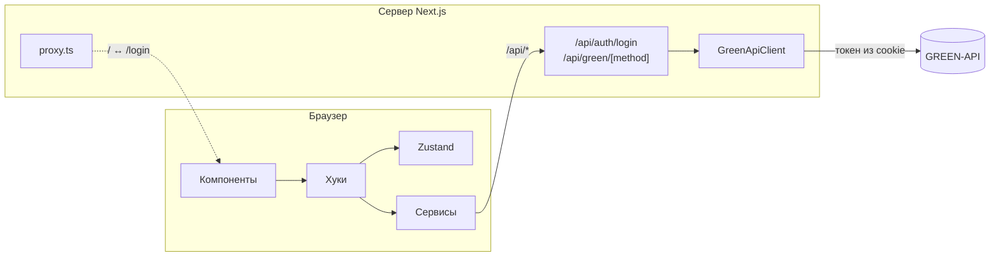

<div align="center">

# GREEN-API Чат

**Веб-клиент WhatsApp на базе [GREEN-API](https://green-api.com): отправка и получение текстовых сообщений прямо из браузера.**


</div>

## Возможности

- 🔐 **Вход по данным инстанса** — `apiUrl`, `idInstance`, `apiTokenInstance` из личного кабинета GREEN-API. Токен хранится в httpOnly-cookie и не доступен скриптам страницы.
- 💬 **Новый чат по номеру телефона** — номер любой страны проверяется через `checkWhatsapp`.
- ✉️ **Отправка сообщений** методом [`SendMessage`](https://green-api.com/docs/api/sending/SendMessage/).
- 📥 **Получение ответов** через [HTTP API](https://green-api.com/docs/api/receiving/technology-http-api/): long-polling `ReceiveNotification` + `DeleteNotification`, пауза на скрытой вкладке.
- 🧩 **Автосоздание чата**, если написал новый собеседник; поддержка ответов с цитатой и групповых чатов.
- 💾 **История сохраняется** в браузере и сбрасывается при входе под другим инстансом.
- 📱 **Адаптивность** — на телефоне список чатов и переписка переключаются, как в мобильном мессенджере.

## Как открыть приложение локально

### 1. Подготовьте инстанс GREEN-API

1. Зарегистрируйтесь в [личном кабинете GREEN-API](https://console.green-api.com) и создайте **WhatsApp**-инстанс.
2. Подключите WhatsApp: откройте на телефоне WhatsApp → **Связанные устройства** → **Привязка устройства** и отсканируйте QR-код из личного кабинета. Статус инстанса должен стать «авторизован».
3. Проверьте, что в настройках инстанса поле `webhookUrl` пустое — иначе приложение не сможет получать сообщения.
4. Скопируйте со страницы инстанса три значения: `apiUrl`, `idInstance` и `apiTokenInstance`. Они понадобятся при входе.

### 2. Скачайте проект и создайте `.env`

```bash
git clone <адрес-репозитория> green-api-test
cd green-api-test
```

В корне проекта создайте файл `.env`:

```env
NEXT_PUBLIC_DOMAIN=http://localhost:3000
```

Файл `.env` не хранится в репозитории, поэтому его нужно создать вручную — без него не соберётся Docker-образ, а выход из аккаунта будет перенаправлять на неверный адрес.

### 3. Запустите приложение

#### Вариант А: без Docker

Понадобятся [Bun](https://bun.sh) 1.3+ и [Node.js](https://nodejs.org) 20.9+.

<details>
<summary>Как установить Bun</summary>

```bash
# macOS / Linux
curl -fsSL https://bun.sh/install | bash

# Windows (PowerShell)
powershell -c "irm bun.sh/install.ps1 | iex"
```

</details>

```bash
bun install
bun run dev
```

Это режим разработки: изменения в коде подхватываются сразу. Чтобы запустить production-сборку:

```bash
bun run build
bun run start
```

Остановить сервер — `Ctrl + C` в терминале.

#### Вариант Б: в Docker

Понадобится [Docker Desktop](https://www.docker.com/products/docker-desktop/) (или Docker Engine). Перед командами убедитесь, что Docker запущен.

```bash
docker build -t green-api-chat .
docker run -d --name green-api-chat -p 3000:3000 green-api-chat
```

Полезные команды:

```bash
docker logs -f green-api-chat     # логи приложения
docker rm -f green-api-chat       # остановить и удалить контейнер
```

После изменений в коде или в `.env` образ нужно пересобрать: снова выполните `docker build`, затем удалите старый контейнер и запустите новый.

### 4. Войдите

1. Откройте <http://localhost:3000> — откроется страница входа.
2. Вставьте `apiUrl`, `idInstance` и `apiTokenInstance` и нажмите **Войти**.
3. Нажмите **+**, введите номер собеседника с кодом страны (например, `+7 999 123-45-67`) и нажмите **Открыть чат**.
4. Напишите сообщение и отправьте его клавишей `Enter`. Ответ собеседника появится в чате автоматически.

> **Порт 3000 занят?** Укажите другой порт в `.env` (например, `NEXT_PUBLIC_DOMAIN=http://localhost:4000`) и запустите:
> без Docker — `bunx next dev -p 4000`; в Docker — пересоберите образ и замените `-p 3000:3000` на `-p 4000:3000`.

## Стек

### Фреймворк и язык

| Технология | Версия | Зачем |
|---|---|---|
| [Next.js](https://nextjs.org) | 16.4 | App Router, Route Handlers, `proxy.ts`, Cache Components, Turbopack |
| [React](https://react.dev) | 19.3 | интерфейс; включён [React Compiler](https://react.dev/learn/react-compiler) |
| [TypeScript](https://www.typescriptlang.org) | 5 | строгая типизация, `verbatimModuleSyntax` |
| [Bun](https://bun.sh) | 1.3 | менеджер пакетов и запуск скриптов |

### Библиотеки

| Библиотека | Зачем |
|---|---|
| [TanStack Query](https://tanstack.com/query) | мутации: вход, создание чата, отправка |
| [Zustand](https://zustand.docs.pmnd.rs) | стор чатов с сохранением в localStorage |
| [Axios](https://axios-http.com) | HTTP-клиент с перехватчиком 401 |
| [React Hook Form](https://react-hook-form.com) | формы и валидация |
| [Tailwind CSS](https://tailwindcss.com) 4 | стили и дизайн-токены |
| [Framer Motion](https://motion.dev) | анимация новых сообщений (`LazyMotion`) |
| [react-hot-toast](https://react-hot-toast.com) | уведомления об ошибках и статусах |
| [Lucide](https://lucide.dev) | иконки |
| [Day.js](https://day.js.org) | форматирование времени |
| [clsx](https://github.com/lukeed/clsx) + [tailwind-merge](https://github.com/dcastil/tailwind-merge) | сборка классов |

### Качество кода

| Инструмент | Зачем |
|---|---|
| [Jest](https://jestjs.io) 30 + [Testing Library](https://testing-library.com) | unit-тесты: 158 тестов, клиентская и серверная части |
| [ESLint](https://eslint.org) 9 + [Prettier](https://prettier.io) | линтинг и форматирование, сортировка импортов |
| [Knip](https://knip.dev) | поиск неиспользуемого кода и зависимостей |

## Архитектура

Браузер никогда не обращается к GREEN-API напрямую. Все запросы идут через сервер Next.js, который берёт токен из httpOnly-cookie и пропускает только разрешённые методы.



```
src/
├── app/          страницы, layout, route handlers (/api/auth, /api/green, /logout)
├── components/   ui/ — примитивы, chat/ — экран чата, forms/ — формы с хуками
├── hooks/        опрос уведомлений, гидрация, сортировка чатов
├── store/        Zustand-стор чатов
├── services/     единственное место HTTP-запросов с клиента
├── api/          экземпляры axios и разбор ошибок
├── server/       cookie, клиент GREEN-API, middlewares, валидаторы
├── configs/      маршруты, ключи мутаций, настройки axios и QueryClient
├── constants/    таймауты, лимиты, SEO, анимации
├── utils/        чистые функции: разбор уведомлений, номера, время
└── types/        DTO GREEN-API и доменные типы
```

**Ключевые решения:**

- **Секреты только на сервере** — токен в httpOnly-cookie, браузер видит лишь `/api/*`.
- **Белый список методов** — новый метод GREEN-API добавляется одной записью в реестр, без правок прокси.
- **Чистая логика отдельно от React** — разбор уведомлений и номеров живёт в `utils/` и тестируется отдельно.
- **Зависимости параметрами** — `usePolling` получает задачу, `GreenApiClient` — `fetch`, поэтому их легко тестировать.

## Документация

| Документ | О чём |
|---|---|
| [Architecture](./docs/Architecture.md) | слои, структура, потоки данных, принятые решения |
| [Authorization](./docs/Authorization.md) | вход, cookie, `proxy.ts`, выход, редиректы |
| [GreenApi](./docs/GreenApi.md) | методы GREEN-API, прокси, особенности WhatsApp, опрос |
| [StateAndData](./docs/StateAndData.md) | стор, гидрация, хуки, мутации, формы |
| [UI](./docs/UI.md) | компоненты, дизайн-токены, адаптивность, анимации |
| [Tests](./docs/Tests.md) | конфигурация Jest, моки, соглашения, покрытие |
| [Deployment](./docs/Deployment.md) | переменные окружения, скрипты, Docker |
| [Conventions](./docs/Conventions.md) | стиль кода и правила проекта |

## Скрипты

| Команда | Что делает |
|---|---|
| `bun run dev` | dev-сервер на порту 3000 |
| `bun run build` | production-сборка |
| `bun run start` | production-сервер на порту 3000 |
| `bun run test` | unit-тесты |
| `bun run lint` | ESLint + Prettier |
| `bun run check` | Knip |
| `bun run format` | форматирование `src/` |

## Контакты

<div align="center">

**Кирилл Вегеле**

[](https://t.me/kerrove)
[](mailto:kirove.work@gmail.com)

</div>
