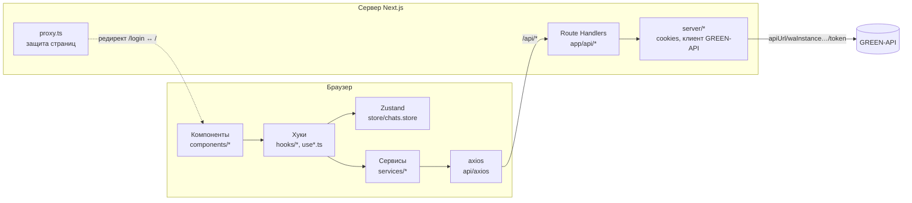
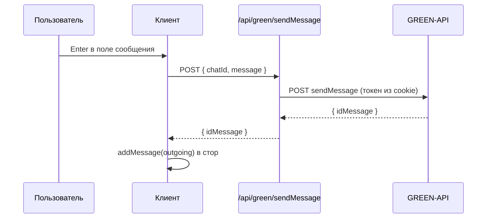

# Архитектура

Приложение — веб-клиент WhatsApp поверх [GREEN-API](https://green-api.com). Браузер никогда не обращается к GREEN-API напрямую: все запросы идут через серверную часть Next.js, которая хранит секреты инстанса в httpOnly-cookie и проксирует вызовы.

## Слои



| Слой | Папка | Ответственность |
|---|---|---|
| Страницы | `src/app` | Тонкие RSC-обёртки, route handlers, layout |
| Компоненты | `src/components` | UI: `ui/` — примитивы, `chat/` — экран чата, `forms/` — формы со своими хуками |
| Хуки | `src/hooks` | Опрос уведомлений, гидрация стора, сортировка чатов |
| Состояние | `src/store` | Zustand-стор чатов и сообщений с сохранением в localStorage |
| Сервисы | `src/services` | Классы-синглтоны, единственное место HTTP-вызовов с клиента |
| HTTP | `src/api` | Экземпляры axios, перехватчик 401, разбор ошибок |
| Конфиги | `src/configs` | Маршруты (`Pages`), ключи мутаций, настройки axios и QueryClient |
| Константы | `src/constants` | Таймауты, лимиты, SEO, пресеты анимаций |
| Утилиты | `src/utils` | Чистые функции: разбор уведомлений, номера телефонов, форматирование |
| Сервер | `src/server` | Работа с cookie, клиент GREEN-API, middlewares, валидаторы |
| Типы | `src/types` | DTO GREEN-API и доменные типы чата |

## Структура проекта

```
src/
├── proxy.ts                         # Next 16: защита страниц до рендера
├── app/
│   ├── layout.tsx                   # шрифт, метаданные, <Providers>
│   ├── page.tsx                     # главная: <Suspense> + ChatScreen
│   ├── ChatScreen.tsx               # RSC: читает cookie, рендерит ChatPage
│   ├── ChatSkeleton.tsx             # скелетон на время загрузки
│   ├── login/                       # страница входа
│   ├── logout/route.ts              # GET: стирает cookie, редирект на /login
│   └── api/
│       ├── auth/login/route.ts      # POST: проверка инстанса, запись cookie
│       └── green/[method]/route.ts  # прокси к GREEN-API по белому списку
├── components/
│   ├── ui/                          # Button, IconButton, Field, Avatar
│   ├── chat/                        # ChatPage, NavRail, sidebar/*, window/*
│   └── forms/                       # login/*, new-chat/* (форма + хук)
├── hooks/                           # usePolling, useNotifications, …
├── store/                           # chats.store, типы и начальное состояние
├── services/                        # auth.service, green-api.service
├── api/                             # axios.ts, api.helper.ts
├── configs/                         # pages, api, query
├── constants/                       # constants, seo, animation
├── server/                          # credentials, green-api, middlewares, validators
├── types/                           # auth, chat, green-api, общие
└── utils/                           # parse-notification, normalize-phone, …
```

## Основные потоки

### Вход

1. Пользователь вводит `apiUrl`, `idInstance`, `apiTokenInstance` (`forms/login`).
2. `authService.login` отправляет их на `POST /api/auth/login`.
3. Сервер валидирует данные, вызывает `getStateInstance` (инстанс должен быть `authorized`) и `getSettings` (инстанс должен быть WhatsApp).
4. Креды записываются в httpOnly-cookie, клиент переходит на `/`.

Подробно — в [Authorization.md](./Authorization.md).

### Отправка сообщения



### Получение сообщений

`useNotifications` в бесконечном цикле (`usePolling`) делает `receiveNotification`. Если пришло уведомление, его разбирает `parseNotification`, результат кладётся в стор, затем вызывается `deleteNotification`. Подробно — в [GreenApi.md](./GreenApi.md).

## Принятые решения

**Секреты не попадают в браузер.** Токен инстанса живёт в httpOnly-cookie и подставляется только на сервере. В сетевых запросах браузера видны лишь `/api/*`.

**Белый список методов (OCP).** Прокси `app/api/green/[method]` пропускает только методы из реестра `server/green-api/green-methods.config.ts`. Новый метод GREEN-API добавляется одной записью в реестре и методом в `green-api.service.ts`; сам route handler не меняется.

**Единый контракт ошибок.** Сервер всегда бросает `GreenApiError { status, message }` и отвечает `{ message }`; клиент читает его через `errorCatch`. Текст ошибки GREEN-API добавляется к понятному описанию статуса.

**Чистая логика отдельно от React (SRP).** Разбор уведомлений, нормализация номеров, форматирование времени — чистые функции в `utils/` с отдельными тестами. Компоненты только отображают.

**Зависимости передаются параметрами (DIP).** `usePolling` принимает задачу, а не знает про GREEN-API; `GreenApiClient` принимает `fetch` в конструкторе; `createUnauthorizedHandler` принимает функцию навигации. Это позволяет тестировать их без моков модулей.

**Защищённые страницы проверяются дважды.** `proxy.ts` перенаправляет до рендера, а `ChatScreen` дополнительно проверяет cookie на сервере.

## Связанные документы

- [Authorization.md](./Authorization.md) — вход, cookie, `proxy.ts`, выход
- [GreenApi.md](./GreenApi.md) — интеграция с GREEN-API и особенности WhatsApp
- [StateAndData.md](./StateAndData.md) — стор, гидрация, хуки и мутации
- [UI.md](./UI.md) — компоненты, дизайн-токены, анимации, адаптивность
- [Tests.md](./Tests.md) — тестовая инфраструктура и соглашения
- [Deployment.md](./Deployment.md) — переменные окружения, скрипты, Docker
- [Conventions.md](./Conventions.md) — стиль кода и правила проекта
