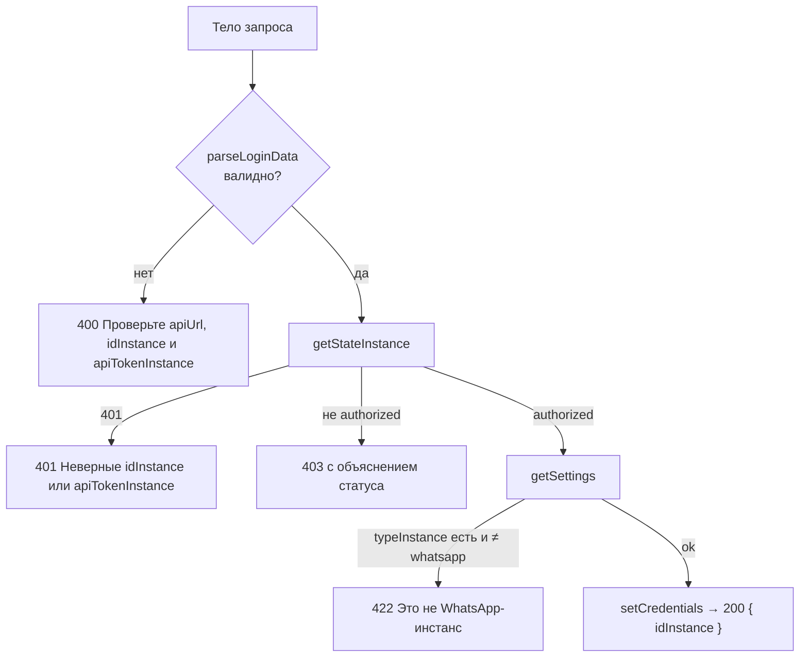

# Авторизация и хранение секретов

## Что считается секретом

Для работы с GREEN-API нужны три значения из [личного кабинета](https://console.green-api.com):

| Поле | Пример | Секрет |
|---|---|---|
| `apiUrl` | `https://7103.api.greenapi.com` | нет |
| `idInstance` | `7103123456` | нет |
| `apiTokenInstance` | длинная строка | **да** |

Все три хранятся одинаково — в httpOnly-cookie, — чтобы не разделять логику.

## Вход: `POST /api/auth/login`

Файл: `src/app/api/auth/login/route.ts`.

**Валидация** (`server/validators/login.validator.ts`):

- все поля — строки, обрезаются пробелы и завершающий `/` у `apiUrl`;
- `idInstance` — только цифры, 6–15 символов;
- `apiUrl` — только `https://*.green-api.com` или `https://*.greenapi.com`. Это не даёт использовать сервер как прокси к произвольным адресам (SSRF).

Те же регулярные выражения (`utils/validators/fields.validator.ts`) используются в форме на клиенте.

**Проверка типа инстанса.** WhatsApp-инстансы не возвращают поле `typeInstance` в `getSettings`; оно есть у других продуктов GREEN-API (например, `v3` у MAX). Поэтому вход отклоняется только при явном значении, отличном от `whatsapp`.

## Cookie

Файл: `src/server/credentials/credentials.server.ts`. Имена cookie — в `EnumCredentials` (`types/auth.types.ts`).

| Параметр | Значение |
|---|---|
| `httpOnly` | `true` — недоступны JavaScript страницы |
| `sameSite` | `lax` |
| `secure` | `true` в production |
| `path` | `/` |
| `maxAge` | 30 дней (`CREDENTIALS_MAX_AGE_SECONDS`) |

Функции:

- `getCredentials(cookies)` — возвращает все три значения или `null`, если хотя бы одного нет;
- `setCredentials(res, credentials)` — ставит cookie на ответ;
- `clearCredentials(res)` — стирает их (`maxAge: 0`).

`getCredentials` принимает любой объект с методом `get(name)`, поэтому работает и с `NextRequest.cookies`, и с `cookies()` из `next/headers`.

> В production cookie ставятся с флагом `Secure`. На `http://localhost` браузеры это допускают, но на другом домене без HTTPS вход не сохранится.

## Защита страниц: `proxy.ts`

В Next.js 16 файл `middleware.ts` переименован в `proxy.ts`. Он выполняется до рендера страницы.

| Путь | Кред нет | Креды есть |
|---|---|---|
| `/` | редирект на `/login` | пропустить |
| `/login` | пропустить | редирект на `/` |

Логика вынесена в `server/middlewares/protect-chat.middleware.ts` и `protect-login.middleware.ts`. Matcher исключает `/api`, статику Next и файлы с расширением.

`ChatScreen` (RSC главной страницы) дополнительно проверяет cookie через `next/headers` и при их отсутствии делает `redirect('/login')`.

## Выход: `GET /logout`

Файл: `src/app/logout/route.ts`. Стирает cookie и перенаправляет на `/login`. Ссылки «Выйти» в интерфейсе — обычные `<a href="/logout">`, чтобы браузер выполнил полноценный переход.

## Абсолютные адреса редиректов

`NextResponse.redirect` требует абсолютный URL. Dev-сервер слушает `0.0.0.0`, поэтому `req.url` содержит `http://0.0.0.0:3000`, и браузер уходил бы на этот адрес.

`server/middlewares/resolve-url.ts` строит адрес от `NEXT_PUBLIC_DOMAIN`:

- `https://chat.example.com` → `https://chat.example.com/login`;
- домен без протокола (`localhost`) дополняется протоколом запроса;
- если переменная пустая — используется адрес запроса.

Все серверные редиректы идут через `nextRedirect`, который использует `resolveUrl`.

## Истёкшие и неверные креды

Если GREEN-API отвечает 401 на проксируемый запрос, прокси возвращает клиенту 401. Перехватчик `httpCliAuth` (`api/axios.ts`) перенаправляет браузер на `/logout`, и пользователь снова попадает на форму входа.

Запрос входа идёт через отдельный экземпляр `httpCli` без этого перехватчика: иначе неверный токен на форме входа перезагружал бы страницу вместо показа ошибки.
