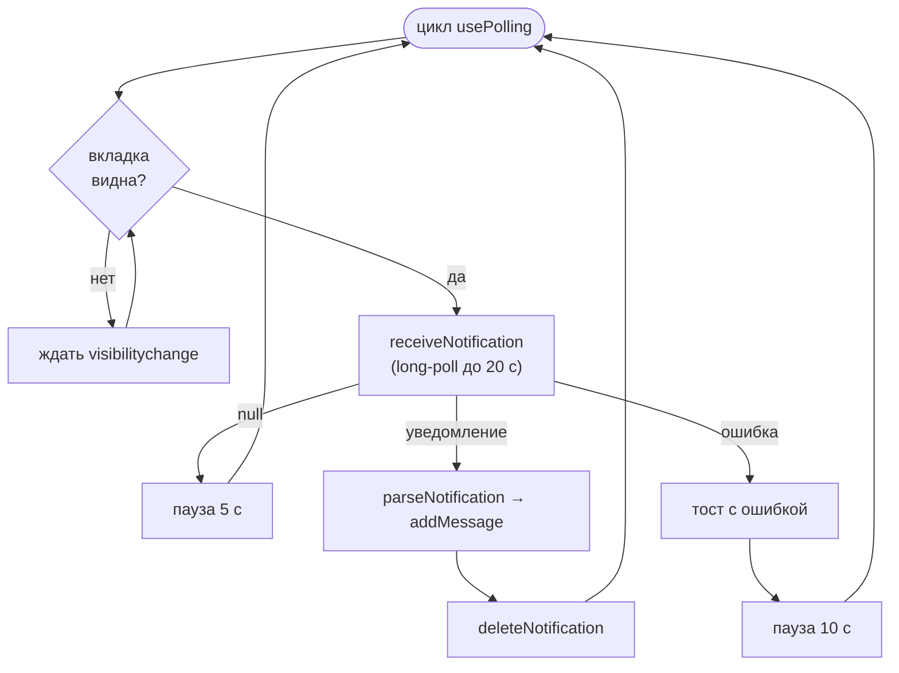

# Интеграция с GREEN-API

## Используемые методы

Все методы вызываются по шаблону:

```
{apiUrl}/waInstance{idInstance}/{method}/{apiTokenInstance}[/{id}][?query]
```

| Метод | HTTP | Где используется | Доступен через прокси |
|---|---|---|---|
| [`getStateInstance`](https://green-api.com/docs/api/account/GetStateInstance/) | GET | проверка при входе | нет |
| [`getSettings`](https://green-api.com/docs/api/account/GetSettings/) | GET | проверка типа инстанса при входе, проверка настроек получения | нет |
| [`setSettings`](https://green-api.com/docs/api/account/SetSettings/) | POST | включение получения входящих по кнопке | нет |
| [`checkWhatsapp`](https://green-api.com/docs/api/service/CheckWhatsapp/) | POST | есть ли у номера WhatsApp | да |
| [`sendMessage`](https://green-api.com/docs/api/sending/SendMessage/) | POST | отправка текста | да |
| [`receiveNotification`](https://green-api.com/docs/api/receiving/technology-http-api/ReceiveNotification/) | GET | получение входящих | да |
| [`deleteNotification`](https://green-api.com/docs/api/receiving/technology-http-api/DeleteNotification/) | DELETE | удаление обработанного уведомления | да |

## Серверная часть

### `GreenApiClient`

Файл: `src/server/green-api/green-api.client.ts`.

- `buildUrl(credentials, method, id?)` — собирает адрес, экранирует части пути, добавляет `receiveTimeout` для `receiveNotification`.
- `request<T>(credentials, method, { httpMethod, id?, body? })` — выполняет `fetch` с `cache: 'no-store'` и таймаутом `GREEN_API_TIMEOUT_MS`.
- Пустой ответ превращается в `null`.
- При ошибке бросается `GreenApiError { status, message }`. Сообщение — понятное описание статуса плюс текст, который вернул GREEN-API, например: `Некорректный запрос к GREEN-API: bad phone number, valid from 11 to 16 digits`.
- Сетевая ошибка или таймаут → `GreenApiError(502, 'GREEN-API недоступен')`.

`fetch` передаётся в конструктор, поэтому в тестах его легко подменить.

### Прокси `/api/green/[method]`

Файл: `src/app/api/green/[method]/route.ts`.

1. Проверяет, что метод есть в реестре `GREEN_METHODS` и HTTP-глагол совпадает, иначе 404.
2. Берёт креды из cookie, иначе 401.
3. Для методов с `withId` требует `?id=`, иначе 400.
4. Для POST требует непустое JSON-тело, иначе 400.
5. Вызывает `greenApiClient.request` и возвращает ответ как есть.

Реестр (`server/green-api/green-methods.config.ts`):

```ts
export const GREEN_METHODS = {
	checkWhatsapp: { httpMethod: 'POST' },
	sendMessage: { httpMethod: 'POST' },
	receiveNotification: { httpMethod: 'GET' },
	deleteNotification: { httpMethod: 'DELETE', withId: true }
}
```

### Как добавить новый метод

1. Добавить имя в `EnumGreenMethod` (`types/green-api.types.ts`) и DTO запроса/ответа.
2. Добавить запись в `GREEN_METHODS`.
3. Добавить метод в `services/green-api.service.ts`.
4. Покрыть тестами сервис и, при необходимости, реестр.

## Клиентская часть

`services/green-api.service.ts` — единственное место, где клиент обращается к прокси. Использует `httpCliAuth`, у которого 401 ведёт на `/logout`.

| Метод сервиса | Запрос |
|---|---|
| `checkWhatsapp(phone)` | `POST /api/green/checkWhatsapp` `{ phoneNumber: number }` |
| `sendMessage(chatId, text)` | `POST /api/green/sendMessage` `{ chatId, message }` |
| `receiveNotification(signal)` | `GET /api/green/receiveNotification` |
| `deleteNotification(receiptId)` | `DELETE /api/green/deleteNotification?id=…` |

`receiveNotification` возвращает `null` и для `null`, и для пустого ответа, и для объекта без `receiptId`.

## Особенности WhatsApp

### chatId

| Тип чата | Формат | Пример |
|---|---|---|
| Личный | `{номер}@c.us` | `79991234567@c.us` |
| Группа | `{id}@g.us` | `120363043968066561@g.us` |

Новый чат по номеру: номер нормализуется (`utils/normalize-phone.ts`), проверяется через `checkWhatsapp`, и chatId строится как `номер@c.us` (`toChatId`).

`checkWhatsapp` может вернуть внутренний идентификатор вида `123456789012345@lid`. Он **намеренно не используется**: по умолчанию входящие уведомления приходят с `@c.us`, и если взять `@lid`, ответы собеседника попадали бы в отдельный чат. Если в настройках инстанса включить режим `EnableLidMode`, входящие начнут приходить с `@lid` — сейчас приложение этот режим не поддерживает.

### Номер телефона

- Любая страна, 11–16 цифр с кодом страны.
- Ведущая `8` у 11-значного номера заменяется на `7`.
- В `checkWhatsapp` номер отправляется числом в поле `phoneNumber`. Документация помечает это поле как устаревшее, но поддерживаемое; новое поле `chatId` реальный инстанс отклонил ошибкой 400.

### Разбор уведомлений

`utils/parse-notification.ts` превращает тело уведомления в доменное событие `IChatEvent` или `null`.

| `typeWebhook` | Направление |
|---|---|
| `incomingMessageReceived` | входящее |
| `outgoingMessageReceived` | исходящее (отправлено с телефона) |
| `outgoingAPIMessageReceived` | исходящее (отправлено через API) |
| прочие (статусы, состояние инстанса) | игнорируются |

| `typeMessage` | Где текст |
|---|---|
| `textMessage` | `textMessageData.textMessage` |
| `extendedTextMessage` | `extendedTextMessageData.text` |
| `quotedMessage` (ответ с цитатой) | `extendedTextMessageData.text` |
| остальные (медиа и т. п.) | игнорируются |

Название чата:

- группа (`@g.us`) или исходящее — `senderData.chatName`;
- входящее в личном чате — `senderContactName`, затем `senderName`, затем `chatName`.

Метка времени GREEN-API — в секундах, в домене хранятся миллисекунды.

## Опрос уведомлений



| Константа | Значение | Смысл |
|---|---|---|
| `RECEIVE_TIMEOUT_SECONDS` | 20 | сколько GREEN-API держит запрос при пустой очереди |
| `GREEN_API_TIMEOUT_MS` | 30 000 | таймаут axios и серверного `fetch` |
| `POLLING_IDLE_DELAY_MS` | 5 000 | пауза после пустого ответа |
| `POLLING_ERROR_DELAY_MS` | 10 000 | пауза после ошибки |

Уведомление удаляется, даже если его не удалось разобрать, иначе оно навсегда застряло бы в начале очереди. Пока очередь не пуста, запросы идут подряд без паузы.

## Настройки получения входящих

Чтобы входящие попадали в очередь `receiveNotification`, у инстанса должны быть:

- `incomingWebhook: "yes"` — получение уведомлений о входящих;
- пустой `webhookUrl` — иначе уведомления уходят на этот адрес, а не в очередь.

**У нового инстанса все настройки выключены**, поэтому сообщения отправляются, но ответы не приходят — без ошибок, очередь просто пустая.

Приложение проверяет это само:

| Что | Где |
|---|---|
| `GET /api/instance/receiving` | вызывает `getSettings` и отдаёт только `{ canReceive, incomingEnabled, webhookUrlSet }` — без `webhookUrlToken` и других настроек |
| `POST /api/instance/receiving` | вызывает `setSettings` с фиксированным набором `{ incomingWebhook: "yes", webhookUrl: "" }`; тело запроса клиента не используется |
| `server/green-api/receiving-settings.ts` | `toReceivingStatus` и `ENABLE_RECEIVING_SETTINGS` — чистая логика, покрыта тестами |
| `components/chat/sidebar/ReceivingBanner.tsx` | плашка в списке чатов с объяснением и кнопкой |

Настройки не меняются без действия пользователя: если `webhookUrl` используется другой интеграцией, плашка предупреждает, что кнопка его очистит. После сохранения GREEN-API перезапускает инстанс и применяет настройки в течение 5 минут. Сообщения, пришедшие до этого, в очередь не попадут.
