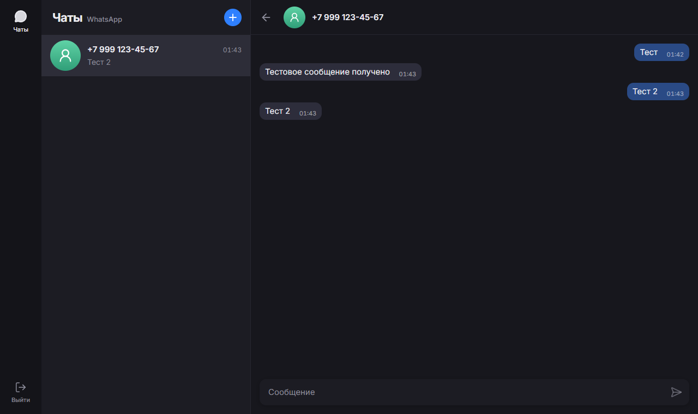
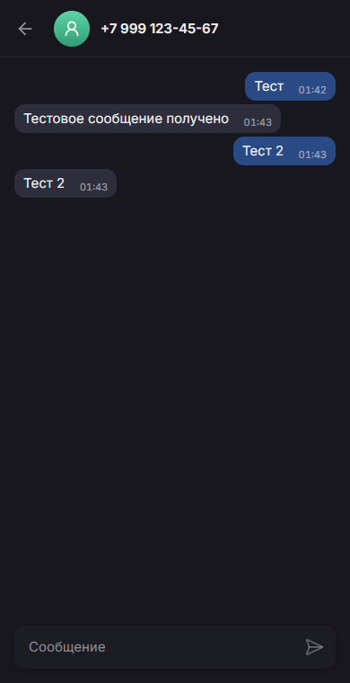

# Интерфейс

Экран повторяет раскладку веб-клиента мессенджера (`assets/chat_page.png`): узкая колонка навигации, список чатов и окно переписки. Тёмная тема, интерфейс на русском.

| Десктоп | Мобильный |
|---|---|
|  |  |

## Компоненты

### Примитивы — `components/ui`

| Компонент | Назначение |
|---|---|
| `Button` | основная и «призрачная» кнопка; по умолчанию `type="button"` |
| `IconButton` | круглая кнопка-иконка; `label` обязателен и становится `aria-label` |
| `Field` | поле формы: подпись, подсказка, ошибка с `role="alert"`, `aria-invalid`, `aria-describedby` |
| `Avatar` | инициалы на градиенте, цвет стабилен для `chatId`; для номеров — иконка пользователя |

### Экран чата — `components/chat`

```
ChatPage
├── NavRail                 колонка навигации (скрыта на мобильных)
├── Sidebar
│   ├── SidebarHeader       «Чаты», кнопка «+», «Выйти» на мобильных
│   ├── ChatList            список или пустое состояние
│   │   └── ChatListItem    аватар, имя, время, превью в 2 строки
│   └── NewChatPanel        заменяет список при нажатии «+»
└── ChatWindow | EmptyChat
    ├── ChatHeader          «назад», аватар, имя, номер
    ├── MessageList         пузыри, автопрокрутка вниз
    │   └── MessageBubble   свои справа, чужие слева, время внутри
    └── MessageInput        Enter — отправить, Shift+Enter — перенос
```

Новый чат открывается панелью внутри сайдбара, а не модальным окном. Панель закрывается кнопкой «назад», клавишей Escape или после успешного создания чата.

## Дизайн-токены

Цвета — CSS-переменные в `src/app/globals.css`, доступные как классы Tailwind через `@theme inline`.

| Токен | Класс | Где используется |
|---|---|---|
| `--rail` | `bg-rail` | колонка навигации |
| `--bg` | `bg-bg` | фон окна чата |
| `--panel` | `bg-panel` | сайдбар, поле ввода, страница входа |
| `--panel-hover` / `--panel-active` | `bg-panel-hover` / `bg-panel-active` | наведение и выбранный чат |
| `--input` | `bg-input` | поля формы |
| `--text` / `--muted` | `text-text` / `text-muted` | основной и вторичный текст |
| `--primary` | `bg-primary`, `text-primary` | кнопки, активные элементы, фокус |
| `--bubble-in` / `--bubble-out` | `bg-bubble-in` / `bg-bubble-out` | входящие и исходящие сообщения |
| `--red` | `text-red`, `border-red` | ошибки |

Градиенты аватаров — в `utils/get-avatar-color.ts`.

Глобальное правило `:focus-visible` находится в `@layer base`, чтобы утилиты Tailwind вроде `focus-visible:outline-none` могли его переопределить.

## Адаптивность

Брейкпоинт `md` переопределён как `max-width: 768px` (подход desktop-first):

```css
@custom-variant md (@media (max-width: 768px));
```

На узких экранах `ChatPage` показывает либо список, либо окно чата — в зависимости от `activeChatId`. Кнопка «назад» в шапке чата закрывает его и возвращает к списку. Колонка навигации скрывается, «Выйти» переезжает в шапку списка.

## Анимации

Подключение в `providers/Providers.tsx`:

- `LazyMotion` с `domAnimation` — компоненты используют лёгкий `m` из `framer-motion/m`;
- `MotionConfig reducedMotion="user"` — уважает системную настройку уменьшения движения.

Анимируется только появление нового сообщения (`MESSAGE_ANIMATION_PROPS` в `constants/animation.constants.ts`). `MessageList` оборачивает пузыри в `AnimatePresence initial={false}`, поэтому история при открытии чата не проигрывается заново. Список чатов и переходы между панелями намеренно не анимируются.

## Тексты

- Подписи полей входа совпадают с названиями в личном кабинете GREEN-API: `apiUrl`, `idInstance`, `apiTokenInstance`.
- Ошибки объясняют, что делать: «У этого номера нет WhatsApp. Проверьте номер или попросите собеседника установить WhatsApp».
- Пустые состояния подсказывают следующий шаг: как начать чат и что чат появится сам, если вам напишут.

## Загрузка

`app/page.tsx` рендерит `ChatScreen` внутри `<Suspense>` со скелетоном `ChatSkeleton`. Это требование `cacheComponents`: чтение cookie на сервере — динамические данные, и их нельзя читать вне `Suspense`.
